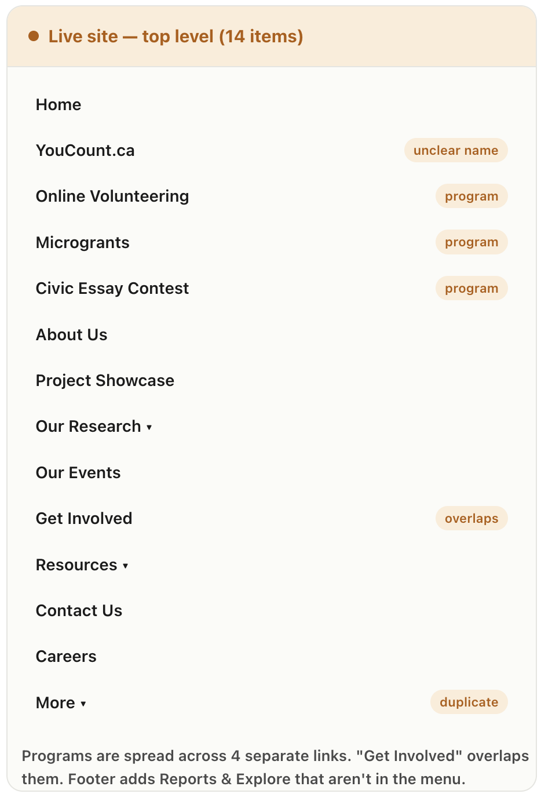
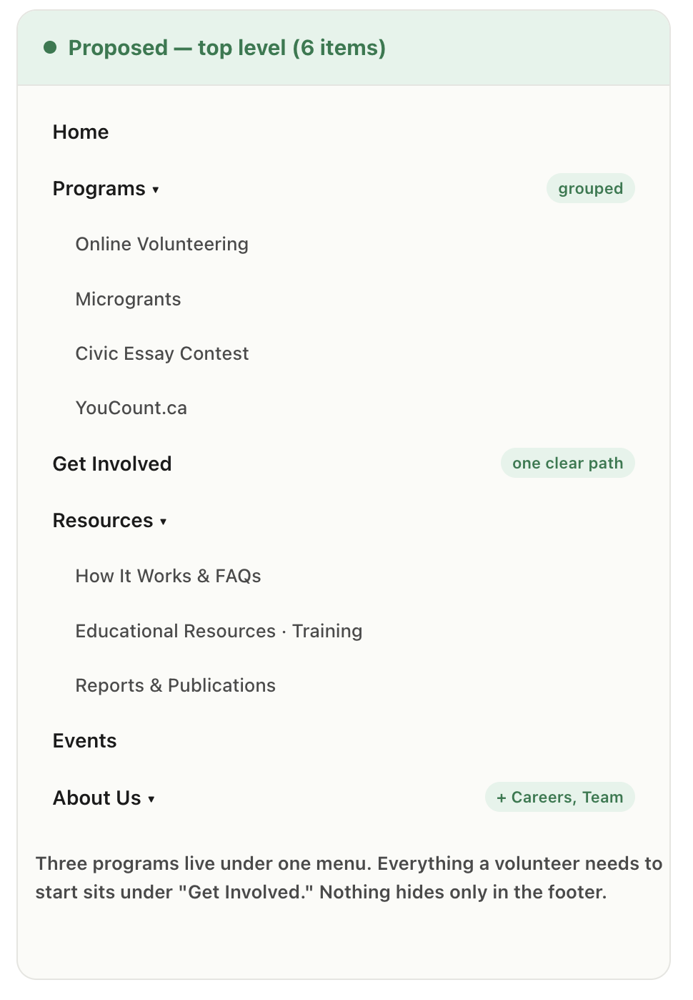

# GLOCAL — Information Architecture Prototype

Interactive prototype for volunteer task **T01205 — Make Interactive Prototypes**
(GLOCAL Foundation of Canada / YouCount, Digital track).

An Information Architecture redesign of [glocalfoundation.ca](https://glocalfoundation.ca/):
the live menu carries 14 top-level items with the core programs scattered. This prototype
proposes a cleaner 6-item structure and lets reviewers experience and test it.

## 🔗 View the live prototype

| | |
|---|---|
| 🌐 **Full clickable site** (proposed IA, all pages) | **[Open →](https://aegnor8.github.io/glocal-ia-prototype/site.html)** |
| 📊 **Analysis + survey + walkthrough** | **[Open →](https://aegnor8.github.io/glocal-ia-prototype/index.html)** |
| 📝 **Take the survey** (Typeform, ~3 min) | **[Open →](https://form.typeform.com/to/MO4HNBTO)** |

## Before / After

## What's inside

- **Full site prototype** (`site.html`) — 14 connected pages with working dropdown
  navigation, breadcrumbs, and real GLOCAL content (programs, $5,000 microgrants,
  120 volunteer hours, six tracks).
- **Analysis view** (`index.html`) — a Before/After comparison, a clickable nav demo,
  an interactive pilot survey, and a stakeholder walkthrough scenario.

## Walkthrough scenario

Maya, a 22-year-old first-time visitor, wants to apply for a $5,000 community grant.
On the live site she meets 14 links and hesitates; in the proposed structure she sees 6,
opens **Programs**, and reaches **Microgrants** on the first click — two clicks to the
application, no search, no backtracking.

## Run locally

Open `site.html` or `index.html` in any browser. No build step, no dependencies.

## Publish on GitHub Pages

1. Push this repo to GitHub.
2. **Settings → Pages → Source: Deploy from a branch → `main` → `/ (root)` → Save.**
3. Your prototype goes live at `https://aegnor8.github.io/glocal-ia-prototype/site.html`.

## Notes

Demonstration only. Content is illustrative and not affiliated with the live GLOCAL site.
The structure shown is a proposal to be validated by the survey.# glocalofcanada-ai-prototype
